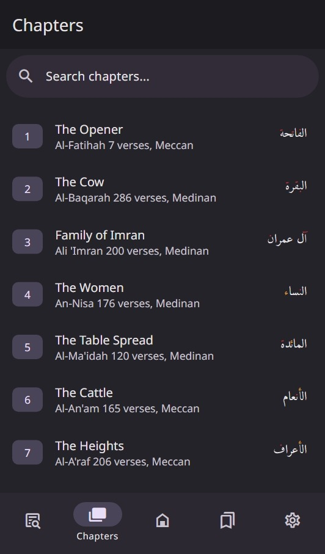
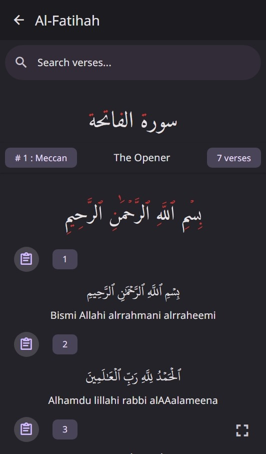
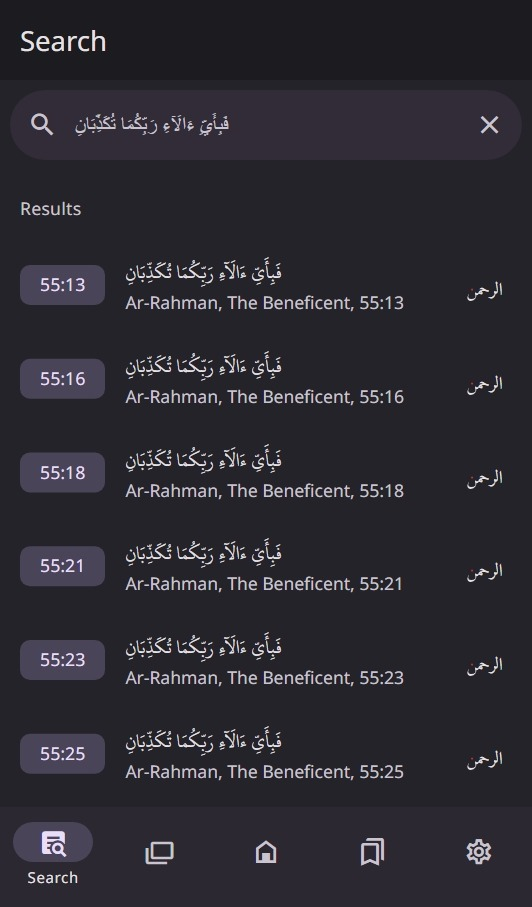

# quran

Cross platform Quran app

## Features

- Expo
- Expo Router
- Material Design V3
- Cross Platform
- LTR and RTL support
- Multi lingual (`ar`, `en` and `tr`)

## Platforms

- Web
- IOS
- Android

## Screenshots

## Built With

- TypeScript
- React
- React Native
- Expo
- Expo Router
- React Native Paper

## Contributing

Contributions are what make the open-source community such an amazing place to learn, inspire, and create. Any contributions you make are greatly appreciated.

1. Fork the Project
2. Create your Feature Branch (git checkout -b feature/AmazingFeature)
3. Commit your Changes (git commit -m 'Add some AmazingFeature')
4. Push to the Branch (git push origin feature/AmazingFeature)
5. Open a Pull Request

## License

Distributed under the MIT License. See LICENSE for more information.
